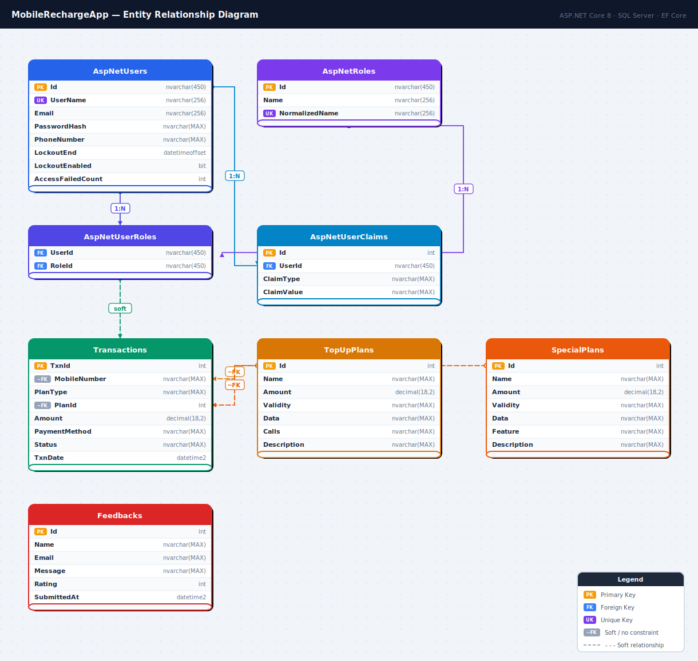

# 📱 Online Mobile Recharge Website

> A full-stack ASP.NET Core MVC web application for mobile recharge management — built for **APTECH eProject Semester 4**.  
> Supports prepaid top-up, special plans, postpaid billing, user accounts, and a complete admin panel.

---

## 🔑 Login Credentials

### 👤 Admin Account
| Field | Value |
|-------|-------|
| **Username / Mobile** | `9999999999` |
| **Password** | `Admin@123` |
| **Role** | Admin |
| **Access** | Full admin dashboard, user management, plans, transactions, feedbacks |

### 👤 Demo User Account
| Field | Value |
|-------|-------|
| **Username / Mobile** | `9876543210` |
| **Password** | `User@123` |
| **Role** | User (Prepaid) |
| **Access** | Recharge, My Account, Feedback |

> **Note:** Accounts are seeded automatically on first run via `SeedData` migration. Mobile number is used as the username for login.

---

## 🛠️ Tech Stack

| Layer | Technology |
|-------|-----------|
| **Framework** | ASP.NET Core MVC (.NET 8) |
| **Language** | C# |
| **Database** | SQL Server Express (LocalDB) |
| **ORM** | Entity Framework Core 8 |
| **Authentication** | ASP.NET Core Identity (mobile number as username) |
| **Authorization** | Role-based (`Admin`, `User`) + Claims (`FullName`, `PlanType`) |
| **Frontend** | Razor Views (`.cshtml`), Bootstrap 5, jQuery |
| **CSS** | Custom CSS with CSS Variables, ClashDisplay font, Line Awesome icons |
| **IDE** | Visual Studio 2022 |

---

## 🚀 Getting Started

---

### ✅ Prerequisites

Before running this project, make sure you have **all of the following** installed:

| Tool | Version | Download | Purpose |
|------|---------|----------|---------|
| **.NET SDK** | 8.0 or later | [dotnet.microsoft.com](https://dotnet.microsoft.com/download/dotnet/8.0) | Runs the ASP.NET Core application |
| **Visual Studio** | 2022 (any edition) | [visualstudio.microsoft.com](https://visualstudio.microsoft.com/downloads/) | Recommended IDE with full tooling support |
| **SQL Server Express** | 2019 or 2022 | [microsoft.com/sql-server](https://www.microsoft.com/en-us/sql-server/sql-server-downloads) | Database engine |
| **SQL Server Management Studio** | 19+ *(optional)* | [SSMS Download](https://learn.microsoft.com/en-us/sql/ssms/download-sql-server-management-studio-ssms) | GUI to inspect tables and run queries |
| **Git** | Any recent | [git-scm.com](https://git-scm.com/downloads) | Clone the repository |

#### Visual Studio Workloads Required

When installing Visual Studio 2022, make sure these **workloads** are checked:

- ✅ **ASP.NET and web development**
- ✅ **Data storage and processing** *(includes SQL Server tools)*

> If already installed, go to **Visual Studio Installer → Modify** to add missing workloads.

---

### 📥 Step 1 — Get the Project

#### Option A: Clone with Git
```bash
git clone https://github.com/your-username/MobileRechargeApp.git
cd MobileRechargeApp
```

#### Option B: Download ZIP
1. Go to the GitHub repository page
2. Click **Code → Download ZIP**
3. Extract the ZIP to a folder of your choice
4. Open the folder

---

### 🗂️ Step 2 — Open in Visual Studio

1. Open **Visual Studio 2022**
2. Click **"Open a project or solution"**
3. Navigate to the extracted/cloned folder
4. Select `MobileRechargeApp.sln` and click **Open**
5. Wait for NuGet packages to restore automatically

> If packages don't restore automatically:  
> Right-click the Solution in **Solution Explorer** → **Restore NuGet Packages**

---

### 🗄️ Step 3 — Set Up the Database

#### 3a. Check SQL Server is Running

Open **Services** (`Win + R` → type `services.msc`) and confirm one of these is **Running**:

| Service Name | Used by |
|---|---|
| `SQL Server (SQLEXPRESS)` | SQL Server Express |
| `SQL Server (MSSQLSERVER)` | Full SQL Server |

Or check via **SQL Server Configuration Manager**:
- Start → search **"SQL Server Configuration Manager"**
- Under **SQL Server Services** → confirm your instance shows **Running**

#### 3b. Update the Connection String

Open `appsettings.json` in the project root and update `DefaultConnection`:

**For SQL Server Express (most common):**
```json
{
  "ConnectionStrings": {
    "DefaultConnection": "Server=.\SQLEXPRESS;Database=MobileRechargeDb;Trusted_Connection=True;TrustServerCertificate=True;"
  }
}
```

**For SQL Server LocalDB (Visual Studio built-in):**
```json
{
  "ConnectionStrings": {
    "DefaultConnection": "Server=(localdb)\mssqllocaldb;Database=MobileRechargeDb;Trusted_Connection=True;MultipleActiveResultSets=true;"
  }
}
```

**For Full SQL Server (named instance):**
```json
{
  "ConnectionStrings": {
    "DefaultConnection": "Server=YOUR_PC_NAME\MSSQLSERVER;Database=MobileRechargeDb;Trusted_Connection=True;TrustServerCertificate=True;"
  }
}
```

> Replace `YOUR_PC_NAME` with your computer name (found by running `hostname` in Command Prompt).

#### 3c. Apply Migrations

Open **Package Manager Console** in Visual Studio:  
**Tools → NuGet Package Manager → Package Manager Console**

Then run:
```powershell
Update-Database
```

This single command will:
- ✅ Create the `MobileRechargeDb` database (if it doesn't exist)
- ✅ Run `CreateIdentitySchema` — create all ASP.NET Identity tables
- ✅ Run `InitialCreate` — create `Transactions`, `TopUpPlans`, `SpecialPlans`, `Feedbacks`
- ✅ Run `SeedData` — insert Admin role, Admin account, demo users, and starter plans

Expected output:
```
Build started...
Build succeeded.
Applying migration '00000000000000_CreateIdentitySchema'.
Applying migration 'XXXXXXXXXXXXXXXX_InitialCreate'.
Applying migration 'XXXXXXXXXXXXXXXX_SeedData'.
Done.
```

> **If you get an error here**, see the [Troubleshooting](#-common-issues--fixes) section below.

---

### ▶️ Step 4 — Run the Application

#### In Visual Studio:
- Press **F5** (with debugger) or **Ctrl + F5** (without debugger)
- The app will build and open automatically in your default browser

#### Via CLI:
```bash
cd MobileRechargeApp
dotnet run
```

The app runs at:
```
https://localhost:7XXX   ← shown in the console output
http://localhost:5XXX    ← HTTP fallback
```

> If a browser security warning appears ("Your connection is not private"), click **Advanced → Proceed** — this is normal for local HTTPS development certificates.

#### Trust the Dev Certificate (first time only):
```bash
dotnet dev-certs https --trust
```
Click **Yes** when Windows asks to install the certificate.

---

### 🔐 Step 5 — Log In & Verify

Once the app is running, verify everything works:

| Test | URL | Credentials |
|------|-----|-------------|
| Home page loads | `/` | *(no login)* |
| Admin login | `/Identity/Account/Login` | `9999999999` / `Admin@123` |
| Admin dashboard | `/Admin/Dashboard` | *(after admin login)* |
| User login | `/Identity/Account/Login` | `9876543210` / `User@123` |
| Feedback form | `/Feedback` | *(no login)* |
| Recharge flow | `/Recharge` | *(no login for prepaid)* |

---

### 📦 Step 6 — NuGet Packages (Auto-restored)

These are already in the `.csproj` and restore automatically. Listed here for reference:

```xml
<PackageReference Include="Microsoft.AspNetCore.Identity.EntityFrameworkCore" Version="8.0.*" />
<PackageReference Include="Microsoft.AspNetCore.Identity.UI"                  Version="8.0.*" />
<PackageReference Include="Microsoft.EntityFrameworkCore.SqlServer"           Version="8.0.*" />
<PackageReference Include="Microsoft.EntityFrameworkCore.Tools"               Version="8.0.*" />
<PackageReference Include="Microsoft.AspNetCore.Diagnostics.EntityFrameworkCore" Version="8.0.*" />
```

If packages fail to restore manually:
```bash
dotnet restore
```

---

### 🌐 Frontend Assets (Already Included)

All frontend libraries are bundled in `wwwroot/assets/` — **no npm or CDN required**.

| Library | Version | Location |
|---------|---------|----------|
| Bootstrap | 5.x | `wwwroot/assets/css/bootstrap.min.css` |
| jQuery | 3.7.1 | `wwwroot/assets/js/jquery-3.7.1.min.js` |
| GSAP | 3.x | `wwwroot/assets/js/gsap.min.js` |
| AOS (Animate on Scroll) | 2.x | `wwwroot/assets/js/aos.js` |
| Owl Carousel | 2.x | `wwwroot/assets/js/owl.carousel.min.js` |
| Slick Slider | 1.x | `wwwroot/assets/js/slick.min.js` |
| Line Awesome Icons | 1.3 | `wwwroot/assets/css/line-awesome.min.css` |
| Font Awesome | 6.x | `wwwroot/assets/css/fontasosome.min.css` |
| Nice Select | — | `wwwroot/assets/js/jquery.nice-select.min.js` |
| ClashDisplay Font | — | `wwwroot/assets/css/clash-display.css` |
| Waypoints | — | `wwwroot/assets/js/waypoints.min.js` |

---

### ♻️ Resetting the Database

If you need a completely fresh database (e.g. to re-run seeding):

```powershell
# In Package Manager Console
Drop-Database
Update-Database
```

Or manually via SSMS:
1. Open SSMS → connect to your server
2. Right-click `MobileRechargeDb` → **Delete** → check "Close existing connections" → OK
3. Run `Update-Database` again in Visual Studio

---

### 🗂️ Project Configuration Files

| File | Purpose |
|------|---------|
| `appsettings.json` | Connection strings, logging config |
| `appsettings.Development.json` | Dev-only overrides (detailed errors) |
| `Properties/launchSettings.json` | Port numbers, HTTPS settings, browser launch |
| `Program.cs` | DI registration, Identity config, middleware pipeline |
| `MobileRechargeApp.csproj` | NuGet dependencies, target framework |

#### Change the Port Number

Open `Properties/launchSettings.json`:
```json
{
  "profiles": {
    "MobileRechargeApp": {
      "applicationUrl": "https://localhost:7100;http://localhost:5100"
    }
  }
}
```
Change `7100` / `5100` to any available ports.

---

## 📁 Project Structure

```
MobileRechargeApp/
│
├── Controllers/
│   ├── HomeController.cs          # Home, About, Contact, Customer Care, Site Map
│   ├── RechargeController.cs      # Online Recharge (Top Up, Special Plans, Payment, Receipt)
│   ├── PostpaidController.cs      # Postpaid billing flow
│   ├── MyAccountController.cs     # DND, Caller Tunes, Edit Profile
│   ├── FeedbackController.cs      # Feedback form submission
│   └── AdminController.cs         # Admin dashboard, Users, Transactions, Plans, Feedbacks
│
├── Models/
│   ├── Transaction.cs             # Transaction entity
│   ├── TopUpPlan.cs               # Top Up plan entity
│   ├── SpecialPlan.cs             # Special plan entity
│   ├── Feedback.cs                # Feedback entity
│   ├── PaymentViewModel.cs        # Payment form view model
│   ├── RechargeViewModel.cs       # Recharge form view model
│   ├── CreateUserViewModel.cs     # Admin create user form
│   ├── EditUserViewModel.cs       # Admin edit user form
│   └── AdminUserViewModel.cs      # Admin user list view model
│
├── Data/
│   └── ApplicationDbContext.cs    # EF Core DbContext with Identity
│
├── Migrations/
│   └── ...                        # EF Core migration files (including seed data)
│
├── Views/
│   ├── Shared/
│   │   ├── _Layout.cshtml         # Main frontend layout (navbar, footer)
│   │   └── _AdminLayout.cshtml    # Admin panel layout (sidebar, topbar)
│   ├── Home/                      # Index, About, Contact, CustomerCare, SiteMap
│   ├── Recharge/                  # Index, TopUpPlans, SpecialPlans, Payment, Receipt
│   │   ├── PostpaidBill.cshtml
│   │   └── PrepaidNotice.cshtml
│   ├── MyAccount/                 # DoNotDisturb, CallerTunes, EditProfile
│   ├── Feedback/                  # Index (feedback form)
│   └── Admin/
│       ├── Dashboard.cshtml       # Bento-style admin dashboard
│       ├── Users.cshtml           # User management table with pagination
│       ├── CreateUser.cshtml      # Add new user form
│       ├── EditUser.cshtml        # Edit user form
│       ├── Transactions.cshtml    # Transaction history with date filter + pagination
│       ├── Feedbacks.cshtml       # Feedback viewer
│       ├── TopUpPlans.cshtml      # Top Up plan management
│       ├── SpecialPlans.cshtml    # Special plan management
│       └── AddTopUpPlan / EditTopUpPlan / AddSpecialPlan / EditSpecialPlan
│
├── Areas/Identity/Pages/Account/
│   ├── Login.cshtml               # Custom login page (mobile number)
│   └── Register.cshtml            # Custom registration page
│
├── wwwroot/
│   ├── assets/
│   │   ├── css/                   # Bootstrap, Line Awesome, ClashDisplay, main.css
│   │   ├── js/                    # jQuery, Bootstrap JS, AOS, Owl Carousel
│   │   └── images/                # Logo, favicon, hero images
│   └── css/
│       ├── site.css               # Frontend custom styles
│       └── admin.css              # Admin panel custom styles
│
├── appsettings.json               # App configuration & connection strings
└── Program.cs                     # App startup, DI, Identity config, Role seeding
```

---

## 🌐 Pages & Routes

### Public Pages (No Login Required)

| Page | Route | Description |
|------|-------|-------------|
| Home | `/` | Hero section, features, plan highlights |
| About Us | `/Home/About` | Company info, team |
| Contact Us | `/Home/Contact` | Contact form |
| Customer Care | `/Home/CustomerCare` | Support info |
| Site Map | `/Home/SiteMap` | All page links |
| Feedback | `/Feedback` | Submit feedback with star rating |
| Register | `/Identity/Account/Register` | New user registration |
| Login | `/Identity/Account/Login` | User login |

### Recharge Pages (Login Required for Postpaid)

| Page | Route | Description |
|------|-------|-------------|
| Online Recharge | `/Recharge` | Enter mobile number, select plan type |
| Top Up Plans | `/Recharge/Plans?mobile=...&type=topup` | Browse and select top-up plans |
| Special Plans | `/Recharge/Plans?mobile=...&type=special` | Browse and select special plans |
| Payment | `/Recharge/Payment` | Select payment method, confirm |
| Receipt | `/Recharge/Receipt?txnId=...` | Transaction success receipt |
| Postpaid Bill | `/Recharge/Postpaid` | Postpaid user's bill history and payment |
| Prepaid Notice | *(auto-redirect)* | Shown when prepaid user visits postpaid |

### My Account Pages (Login Required)

| Page | Route | Description |
|------|-------|-------------|
| Do Not Disturb | `/MyAccount/DoNotDisturb` | Toggle DND service |
| Caller Tunes | `/MyAccount/CallerTunes` | Browse and activate caller tunes |
| Edit Profile | `/MyAccount/EditProfile` | Update name, email, password |

### Admin Pages (Admin Role Required)

| Page | Route | Description |
|------|-------|-------------|
| Dashboard | `/Admin/Dashboard` | Bento stats, recent transactions, donut chart |
| All Users | `/Admin/Users` | Paginated user list with edit/delete |
| Create User | `/Admin/CreateUser` | Add new user with plan type |
| Edit User | `/Admin/EditUser/{id}` | Update user details |
| Transactions | `/Admin/Transactions` | Full transaction history with date filter |
| Feedbacks | `/Admin/Feedbacks` | View all submitted feedback |
| Top Up Plans | `/Admin/TopUpPlans` | List, add, edit, delete top-up plans |
| Special Plans | `/Admin/SpecialPlans` | List, add, edit, delete special plans |

---

## 🗄️ Database Schema

The application uses **SQL Server** with **Entity Framework Core** (Code-First). Below are all tables with exact columns, data types, constraints, and a visual ERD.

---

### 📊 ERD Diagram



> The `erd.svg` file is in the repo root — GitHub renders it automatically above.  
> You can also open it directly in any browser for a full-size view.

---

### 🔷 AspNetUsers *(ASP.NET Identity — mobile number as UserName)*

| Column | SQL Type | Constraint | Notes |
|--------|----------|-----------|-------|
| `Id` | `nvarchar(450)` | **PK** | Auto-generated GUID |
| `UserName` | `nvarchar(256)` | UNIQUE, NOT NULL | **10-digit mobile number** (login username) |
| `NormalizedUserName` | `nvarchar(256)` | UNIQUE | Uppercase mobile for internal lookups |
| `Email` | `nvarchar(256)` | nullable | Auto-set to `{mobile}@mobilerecharge.com` |
| `NormalizedEmail` | `nvarchar(256)` | nullable | Uppercase email |
| `EmailConfirmed` | `bit` | NOT NULL | Default `0` |
| `PasswordHash` | `nvarchar(MAX)` | nullable | bcrypt hash via ASP.NET Identity |
| `PhoneNumber` | `nvarchar(MAX)` | nullable | Same as UserName |
| `PhoneNumberConfirmed` | `bit` | NOT NULL | Default `0` |
| `TwoFactorEnabled` | `bit` | NOT NULL | Default `0` |
| `LockoutEnd` | `datetimeoffset(7)` | nullable | Non-null = account locked |
| `LockoutEnabled` | `bit` | NOT NULL | Default `1` |
| `AccessFailedCount` | `int` | NOT NULL | Default `0` |
| `SecurityStamp` | `nvarchar(MAX)` | nullable | Changed on password reset |
| `ConcurrencyStamp` | `nvarchar(MAX)` | nullable | EF optimistic concurrency |

> **Design note:** `FullName` and `PlanType` are **not columns** — they are stored in `AspNetUserClaims` as key-value pairs. This follows ASP.NET Identity's extensibility pattern without modifying the base `IdentityUser` class.

---

### 🔷 AspNetRoles

| Column | SQL Type | Constraint | Notes |
|--------|----------|-----------|-------|
| `Id` | `nvarchar(450)` | **PK** | Auto-generated GUID |
| `Name` | `nvarchar(256)` | nullable | `Admin` or `User` |
| `NormalizedName` | `nvarchar(256)` | UNIQUE | `ADMIN` or `USER` |
| `ConcurrencyStamp` | `nvarchar(MAX)` | nullable | |

**Seeded values:**

| `Name` | `NormalizedName` | Purpose |
|--------|-----------------|---------|
| `Admin` | `ADMIN` | Full admin panel access |
| `User` | `USER` | Frontend recharge & account access |

---

### 🔷 AspNetUserRoles *(Junction)*

| Column | SQL Type | Constraint |
|--------|----------|-----------|
| `UserId` | `nvarchar(450)` | **PK**, FK → `AspNetUsers.Id` |
| `RoleId` | `nvarchar(450)` | **PK**, FK → `AspNetRoles.Id` |

---

### 🔷 AspNetUserClaims

| Column | SQL Type | Constraint | Notes |
|--------|----------|-----------|-------|
| `Id` | `int` | **PK**, IDENTITY(1,1) | Auto-increment |
| `UserId` | `nvarchar(450)` | FK → `AspNetUsers.Id`, NOT NULL | Cascades on delete |
| `ClaimType` | `nvarchar(MAX)` | nullable | Key name |
| `ClaimValue` | `nvarchar(MAX)` | nullable | Key value |

**Claims used in this app:**

| `ClaimType` | `ClaimValue` example | Used for |
|-------------|---------------------|---------|
| `FullName` | `Ahmed Khan` | Navbar greeting, profile page, admin user list |
| `PlanType` | `Prepaid` or `Postpaid` | Determines postpaid bill page access |

---

### 🔷 Transactions

| Column | SQL Type | Constraint | Notes |
|--------|----------|-----------|-------|
| `TxnId` | `int` | **PK**, IDENTITY(1,1) | Displayed as `#TXN000001` (6-digit padded) |
| `MobileNumber` | `nvarchar(MAX)` | NOT NULL | Recharged number — soft link to `AspNetUsers.UserName` |
| `PlanType` | `nvarchar(MAX)` | NOT NULL | `topup` / `special` / `postpaid` |
| `PlanId` | `int` | NOT NULL | FK to `TopUpPlans.Id` or `SpecialPlans.Id`; `0` for postpaid |
| `Amount` | `decimal(18,2)` | NOT NULL | Amount paid in Pakistani Rs. |
| `PaymentMethod` | `nvarchar(MAX)` | NOT NULL | `EasyPaisa`, `JazzCash`, `Bank Transfer`, `Cash` |
| `Status` | `nvarchar(MAX)` | NOT NULL | `Success` (always, current version) |
| `TxnDate` | `datetime2(7)` | NOT NULL | Set to `DateTime.Now` on insert |

---

### 🔷 TopUpPlans

| Column | SQL Type | Constraint | Notes |
|--------|----------|-----------|-------|
| `Id` | `int` | **PK**, IDENTITY(1,1) | |
| `Name` | `nvarchar(MAX)` | NOT NULL | e.g. `Weekly Unlimited` |
| `Amount` | `decimal(18,2)` | NOT NULL | Price in Rs. |
| `Validity` | `nvarchar(MAX)` | NOT NULL | e.g. `7 days`, `30 days` |
| `Data` | `nvarchar(MAX)` | nullable | e.g. `5GB`, `Unlimited` |
| `Calls` | `nvarchar(MAX)` | nullable | e.g. `200 mins`, `Unlimited` |
| `Description` | `nvarchar(MAX)` | nullable | Shown on payment page and receipt |

---

### 🔷 SpecialPlans

| Column | SQL Type | Constraint | Notes |
|--------|----------|-----------|-------|
| `Id` | `int` | **PK**, IDENTITY(1,1) | |
| `Name` | `nvarchar(MAX)` | NOT NULL | e.g. `Social Pack` |
| `Amount` | `decimal(18,2)` | NOT NULL | Price in Rs. |
| `Validity` | `nvarchar(MAX)` | NOT NULL | e.g. `7 days` |
| `Data` | `nvarchar(MAX)` | nullable | Data allowance if applicable |
| `Feature` | `nvarchar(MAX)` | nullable | e.g. `Unlimited WhatsApp + Facebook` |
| `Description` | `nvarchar(MAX)` | nullable | Shown on payment page and receipt |

---

### 🔷 Feedbacks

| Column | SQL Type | Constraint | Notes |
|--------|----------|-----------|-------|
| `Id` | `int` | **PK**, IDENTITY(1,1) | |
| `Name` | `nvarchar(MAX)` | NOT NULL | Submitter full name |
| `Email` | `nvarchar(MAX)` | NOT NULL | Submitter email |
| `Message` | `nvarchar(MAX)` | NOT NULL | Feedback text (10–500 chars validated client-side) |
| `Rating` | `int` | NOT NULL | Star rating 1–5 (0 if not submitted via new form) |
| `SubmittedAt` | `datetime2(7)` | NOT NULL | Set to `DateTime.Now` on insert |

---

### 🔗 Relationships Reference

| From | To | Type | Join / Key |
|------|----|------|------------|
| `AspNetUsers` | `AspNetUserRoles` | One-to-Many | `UserId` |
| `AspNetRoles` | `AspNetUserRoles` | One-to-Many | `RoleId` |
| `AspNetUsers` | `AspNetUserClaims` | One-to-Many | `UserId` (cascade delete) |
| `AspNetUsers` | `Transactions` | **Soft** One-to-Many | `MobileNumber` = `UserName` (no FK) |
| `TopUpPlans` | `Transactions` | **Soft** One-to-Many | `PlanId` when `PlanType = "topup"` |
| `SpecialPlans` | `Transactions` | **Soft** One-to-Many | `PlanId` when `PlanType = "special"` |

> **Why soft FKs on Transactions?** Deleting a user or plan will not cascade-delete their transaction history. This is intentional — financial records must be preserved for auditing even after accounts or plans are removed.

---

### 🗂️ DbContext Definition

```csharp
// Data/ApplicationDbContext.cs
public class ApplicationDbContext : IdentityDbContext<IdentityUser>
{
    public ApplicationDbContext(DbContextOptions<ApplicationDbContext> options)
        : base(options) { }

    public DbSet<Transaction>  Transactions  { get; set; }
    public DbSet<TopUpPlan>    TopUpPlans    { get; set; }
    public DbSet<SpecialPlan>  SpecialPlans  { get; set; }
    public DbSet<Feedback>     Feedbacks     { get; set; }

    // Inherited from IdentityDbContext:
    // DbSet<IdentityUser>            Users
    // DbSet<IdentityRole>            Roles
    // DbSet<IdentityUserRole<string>> UserRoles
    // DbSet<IdentityUserClaim<string>> UserClaims
    // + UserLogins, UserTokens, RoleClaims
}
```

---

### 📋 Migrations

| # | Migration Name | What It Creates |
|---|---------------|-----------------|
| 1 | `00000000000000_CreateIdentitySchema` | All `AspNet*` Identity tables (auto-generated by scaffolding) |
| 2 | `InitialCreate` | `Transactions`, `TopUpPlans`, `SpecialPlans`, `Feedbacks` |
| 3 | `SeedData` | Admin & User roles, Admin account, demo users, starter plans — all guarded with `IF NOT EXISTS` |

**Apply all migrations:**
```bash
# Visual Studio — Package Manager Console
Update-Database

# CLI
dotnet ef database update
```

**Reset database completely:**
```bash
Drop-Database        # Visual Studio PMC
Update-Database      # Re-apply everything + seed
```

---

## 📦 NuGet Packages Used

```xml
<PackageReference Include="Microsoft.AspNetCore.Identity.EntityFrameworkCore" Version="8.0.*" />
<PackageReference Include="Microsoft.EntityFrameworkCore.SqlServer" Version="8.0.*" />
<PackageReference Include="Microsoft.EntityFrameworkCore.Tools" Version="8.0.*" />
<PackageReference Include="Microsoft.AspNetCore.Identity.UI" Version="8.0.*" />
<PackageReference Include="Microsoft.AspNetCore.Diagnostics.EntityFrameworkCore" Version="8.0.*" />
```

---

## 🐛 Common Issues & Fixes

### Migration Error: "Cannot find table"
Run `Update-Database` from Package Manager Console to apply all pending migrations.

### Login Fails After Fresh Setup
Make sure `Update-Database` completed successfully — the seed migration creates the admin user.

### `@keyframes` / `@media` Errors in .cshtml
In Razor views, all CSS `@` rules must be escaped as `@@`:
```css
/* Wrong */  @keyframes fadeIn { }
/* Correct */ @@keyframes fadeIn { }
```

### Port Already in Use
Change the port in `launchSettings.json` under `Properties/`.

### SQL Server Connection Error
Ensure SQL Server Express is running. Check via SQL Server Configuration Manager or Services.

---

## 👨‍💻 Developer

| Field | Info |
|-------|------|
| **Student** | *(Your Name)* |
| **Enrollment** | *(Your Enrollment No.)* |
| **Course** | APTECH — Semester 4 |
| **Project** | eProject 1st Status Submission |
| **Tech** | ASP.NET Core MVC 8, SQL Server, EF Core |
| **Submitted** | March 2026 |

---

## 📄 License

This project was developed for **academic purposes** as part of the APTECH Computer Education curriculum. Not for commercial use.
